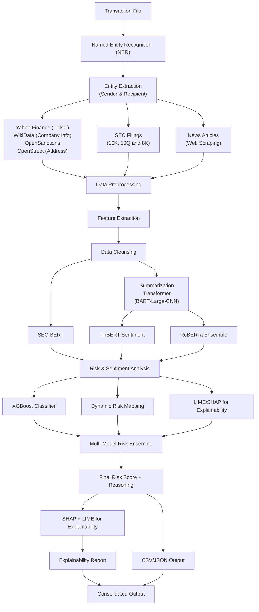

```mermaid
flowchart TD

%% Data Sources
T1[Transaction File] --> T2[Named Entity Recognition  #40;NER#41;]
T2 --> A1[
        Entity Extraction
        #40;Sender & Recipient#41;
    ]
A1 --> A2[
        Yahoo Finance #40;Ticker#41;
        WikiData #40;Company Info#41;
        OpenSanctions
        OpenStreet #40;Address#41;
    ]
A1 --> A3[SEC Filings <br> #40;10K, 10Q and 8K#41;]
A1 --> A5[News Articles <br> #40;Web Scraping#41;]
A2 --> A4[Data Preprocessing]
A3 --> A4
A5 --> A4

%% Data Preprocessing and Extraction
A4 --> B1[Feature Extraction]
B1 --> B2[Data Cleansing]
B2 --> C1[SEC-BERT]

%% Summarization
B2--> S1[
        Summarization
        Transformer
        #40;BART-Large-CNN#41;
    ]
S1 --> C2[FinBERT Sentiment]
S1 --> C3[RoBERTa Ensemble]

%% Risk Analysis and Sentiment
C1 --> D1[Risk & Sentiment Analysis]
C2 --> D1
C3 --> D1

%% XGBoost, Risk Mapping, and Explainability
D1 --> E1[XGBoost Classifier]
D1 --> E2[Dynamic Risk Mapping]
D1 --> E3[LIME/SHAP for Explainability]

%% Multi-Model Ensemble and Risk Prediction
E1 --> F1[Multi-Model Risk Ensemble]
E2 --> F1
E3 --> F1

%% Final Risk Score and Explainability
F1 --> G1[Final Risk Score + Reasoning]
G1 --> H1[SHAP + LIME for Explainability]
H1 --> I1[Explainability Report]

%% Final Output
G1 --> J1[CSV/JSON Output]
I1 --> K1[Consolidated Output]
J1 --> K1
```
